# 🧸 Baby Toys Store — E-Commerce Platform

A full-stack MERN (MongoDB, Express, React, Node.js) e-commerce platform built for babies' and kids' toys, developed as an advanced internship project for **ULT Technology**.

## 📖 Overview

Baby Toys Store is a complete online shopping platform where customers can browse toys by category, age range, price, and rating; add products (including size/color variants) to their cart or wishlist; apply discount coupons; and pay securely via Stripe. Admins and staff manage the catalog, moderate customer reviews, track and update orders, and export data for reporting — all through a role-based admin panel.

---

## 🌐 Live Demo & Resources
- **Live Frontend:** https://baby-toy-store-five.vercel.app/
- **Live Backend API:** https://baby-toy-store-production.up.railway.app

## 🔑 Demo Accounts for Testing
| Role | Email | Password |
| :--- | :--- | :--- |
| **Admin** | admin@toystore.com | Admin123! |
| **Staff** | staff@toystore.com | Staff123! |
| **Customer** | customer@toystore.com | Customer123! |

---

## 📐 Architecture & ER Diagrams

### System Architecture
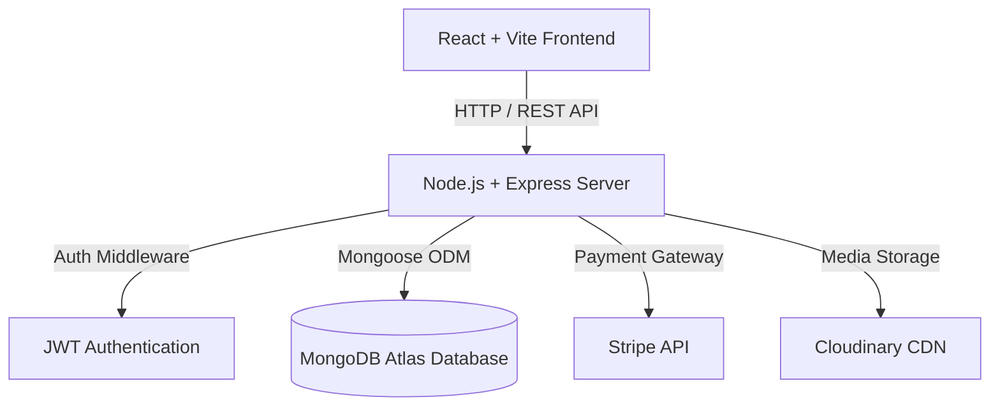

### Database ER Diagram

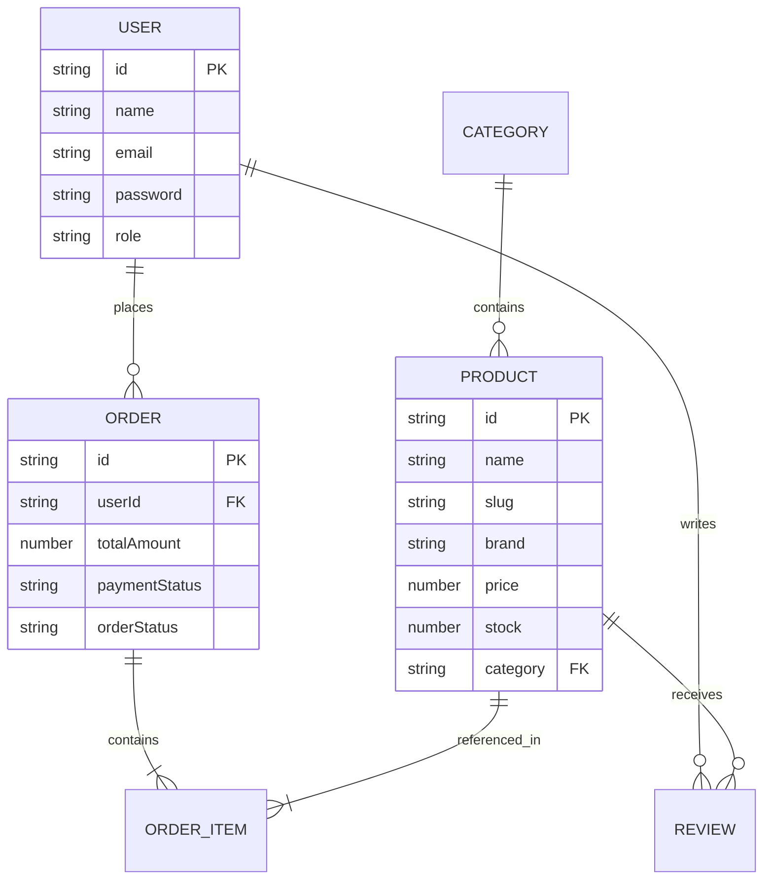

---

## 🛠️ Tech Stack

**Frontend**

* React (Vite)
* React Router DOM
* Redux Toolkit
* Tailwind CSS
* Axios
* React Hot Toast (notifications)
* Stripe.js / React Stripe.js (payments)

**Backend**

* Node.js + Express
* MongoDB + Mongoose
* JWT (authentication)
* Stripe (payment processing + webhooks)
* Cloudinary + Multer (image uploads)
* Helmet, express-mongo-sanitize, express-rate-limit (security)
* Jest + Supertest + mongodb-memory-server (automated testing)

---

## ✨ Features

### Customer-facing

* User registration & login (JWT-based authentication)
* Product browsing with search (with **Debounce optimization**), category, age-range, brand, price, and minimum-rating filters
* Sorting (newest, price low-high, price high-low, rating)
* Product detail pages with size/color **variant selection** (variant-specific stock & pricing)
* Shopping cart (add, update quantity, remove) — variant-aware
* Wishlist functionality
* Coupon codes (percentage or fixed discount, with minimum order & expiry rules)
* Secure checkout via Stripe (webhook-verified payments — not trusted client-side)
* Order history with full status timeline (Pending Payment → Paid → Processing → Packed → Shipped → Delivered, etc.)
* Product reviews with verified-purchase badges
* In-app notifications for order updates

### Admin / Staff

* Role-based access control (customer / staff / admin)
* Add/Update products, including multiple size/color variants with independent stock & optional price overrides
* Review moderation (approve / hide / delete customer reviews)
* Order management — view all orders, update status with notes, full status history
* Admin analytics dashboard (revenue, order counts, product/customer counts, order status breakdown)
* CSV export for products and orders
* Staff account creation (admin-only)
* **Audit logs** — tracks key admin/staff actions with timestamp and actor

---

## 🔐 User Roles

| Role | Access |
| --- | --- |
| **Customer** | Browse, cart, wishlist, checkout, reviews, order history |
| **Staff** | All admin catalog/order/review tools (except staff creation) |
| **Admin** | Full access, including staff account creation |

---

## 📂 Folder Structure

```text
baby-toy-store/
├── client/                     # React frontend (Vite)
│   └── src/
│       ├── components/         # Shared components (Navbar, Lightbox, Skeleton, etc.)
│       ├── hooks/              # Custom Hooks (useDebounce, etc.)
│       ├── pages/              # Route pages (Products, Cart, Admin)
│       └── services/           # Axios API instance
└── server/                     # Express backend
    └── src/
        ├── controllers/        # Route business logic
        ├── models/             # Mongoose schemas
        ├── routes/             # Express routers
        ├── middlewares/        # Auth, upload, rate limiters
        ├── utils/              # Seed scripts, audit logging
        └── tests/              # Jest test suites

```

---

## 🔌 API Overview

| Method | Endpoint | Description |
| --- | --- | --- |
| **POST** | `/api/auth/register` | Register a new customer |
| **POST** | `/api/auth/login` | Login user |
| **GET** | `/api/products` | List products (filters, search, pagination) |
| **GET** | `/api/products/export/csv` | Export products as CSV (admin/staff) |
| **POST** | `/api/products` | Create product (admin/staff) |
| **GET** | `/api/cart` | Get current user's cart |
| **POST** | `/api/cart` | Add item to cart |
| **POST** | `/api/orders` | Create order from cart |
| **GET** | `/api/orders/all` | List all orders (admin/staff) |
| **GET** | `/api/orders/export/csv` | Export orders as CSV (admin/staff) |
| **PUT** | `/api/orders/:id/status` | Update order status (admin/staff) |
| **GET** | `/api/reviews/:productId` | Get approved reviews for a product |
| **POST** | `/api/reviews/:productId` | Submit a review |
| **PATCH** | `/api/reviews/moderate/:reviewId` | Approve/hide a review (admin/staff) |
| **POST** | `/api/coupons/validate` | Validate a coupon code |
| **GET** | `/api/audit-logs` | View audit logs (admin/staff) |

---

## ⚙️ Setup Instructions

### Prerequisites

* Node.js (v18+)
* MongoDB Atlas account
* Stripe account (test mode)
* Cloudinary account

### Backend Setup

```bash
cd server
npm install
npm run seed
npm run seed:coupons
npm run dev

```

### Frontend Setup

```bash
cd client
npm install
npm run dev

```

---

## 📸 Screenshots

### Customer View
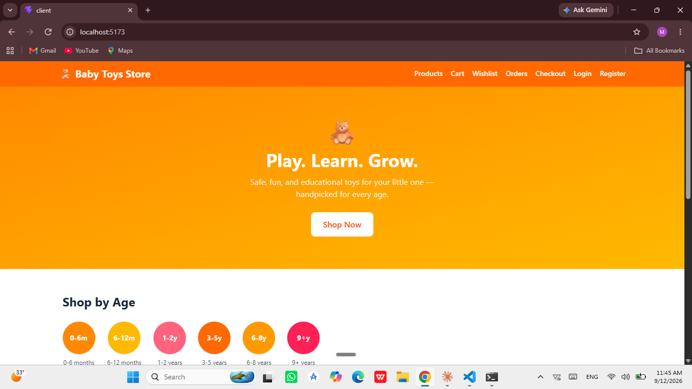
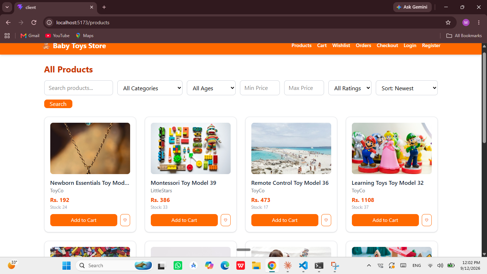
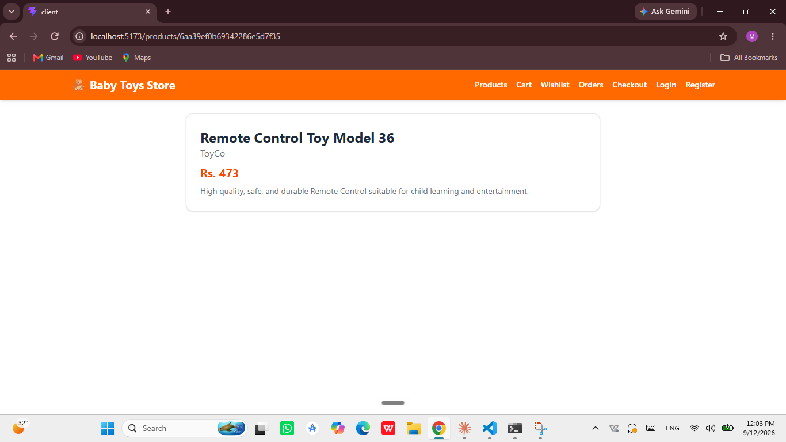
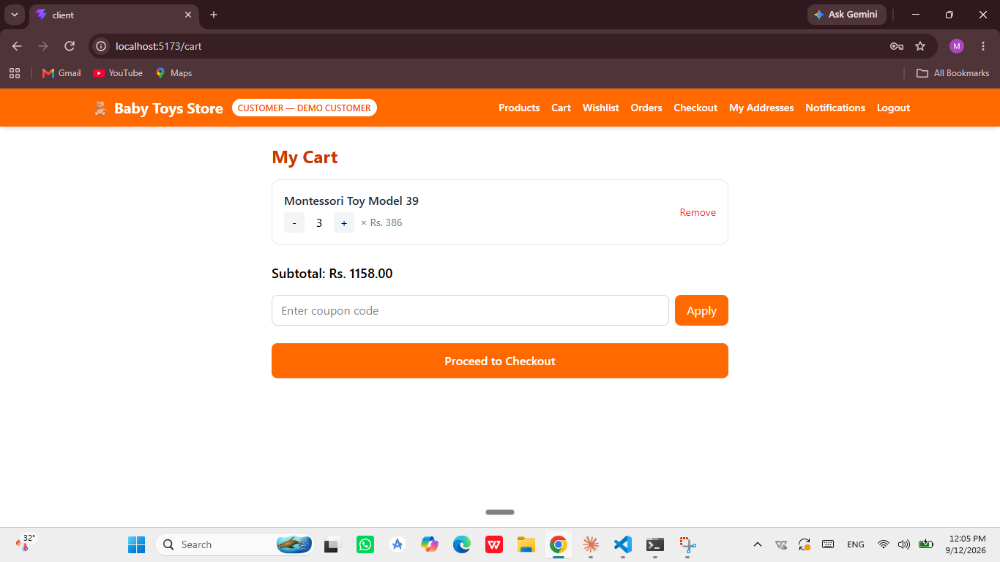
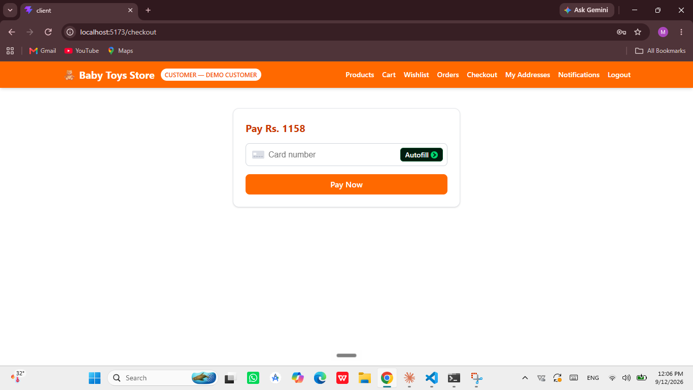
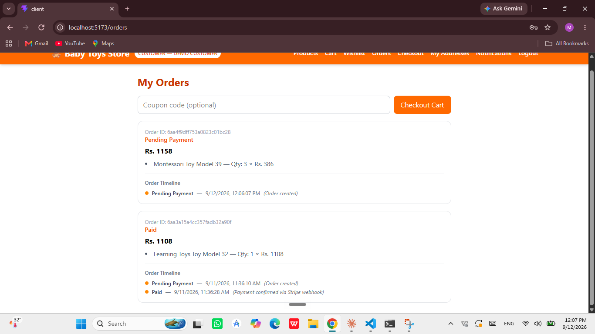
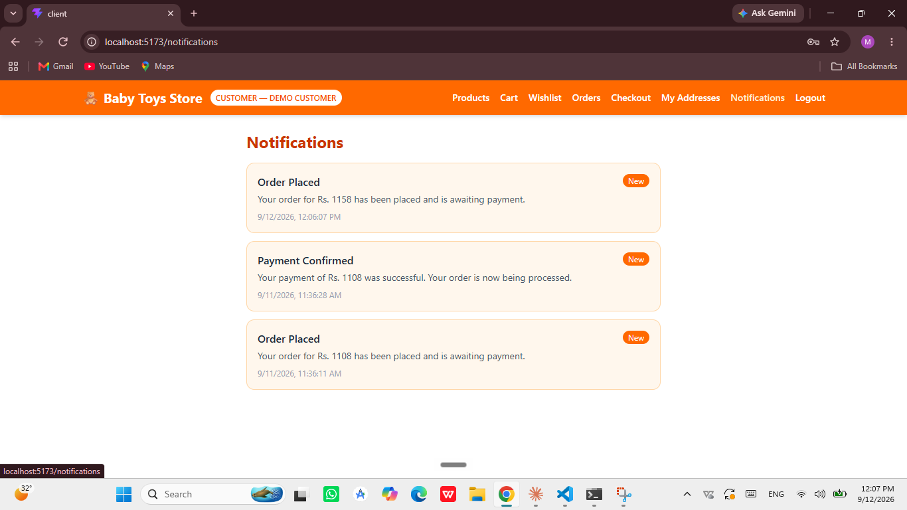

### Admin View
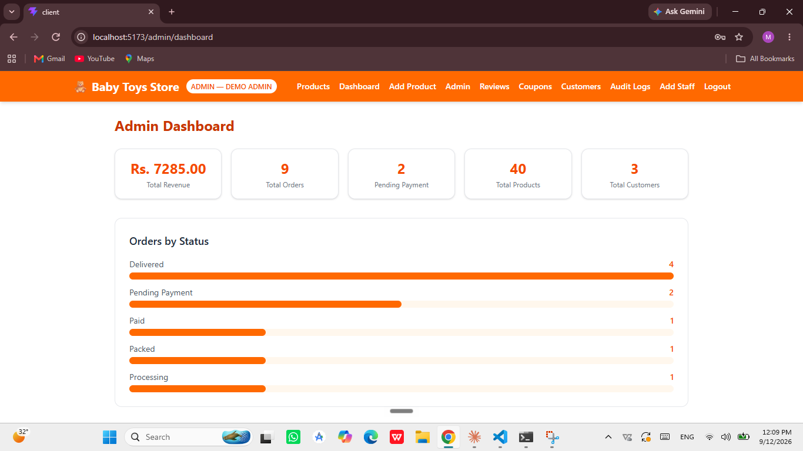
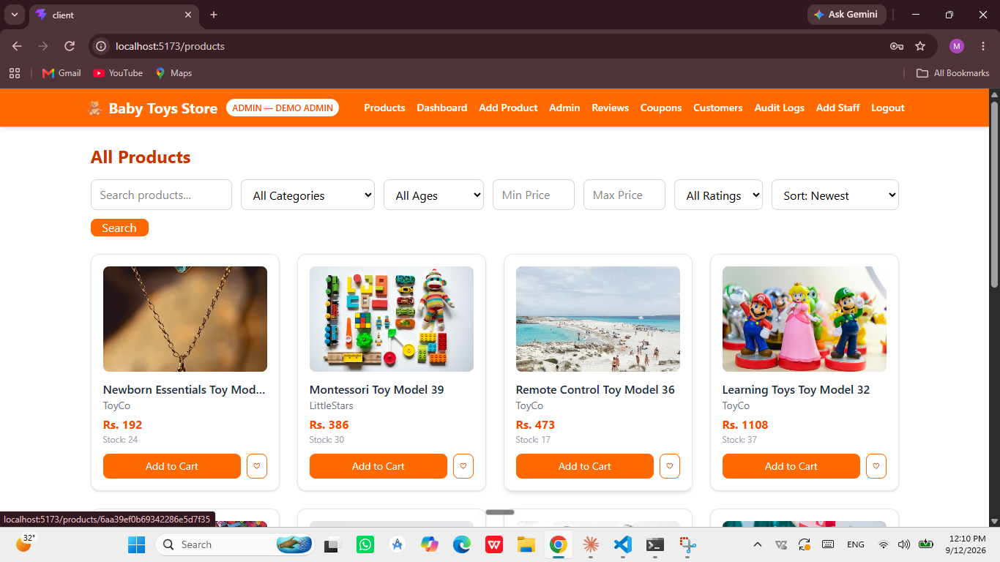
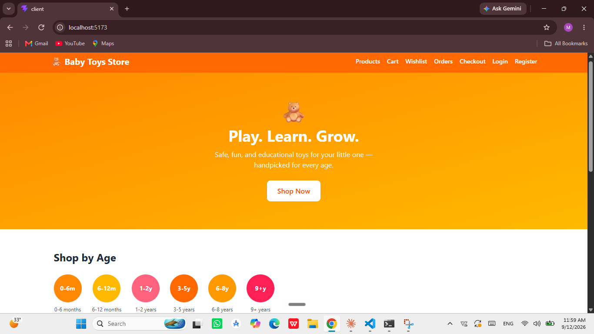

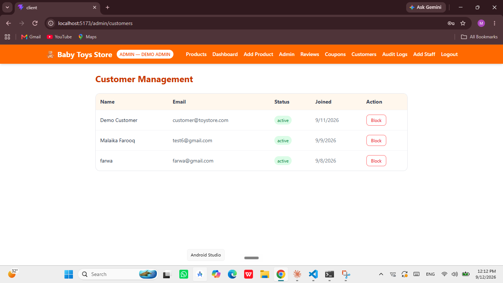
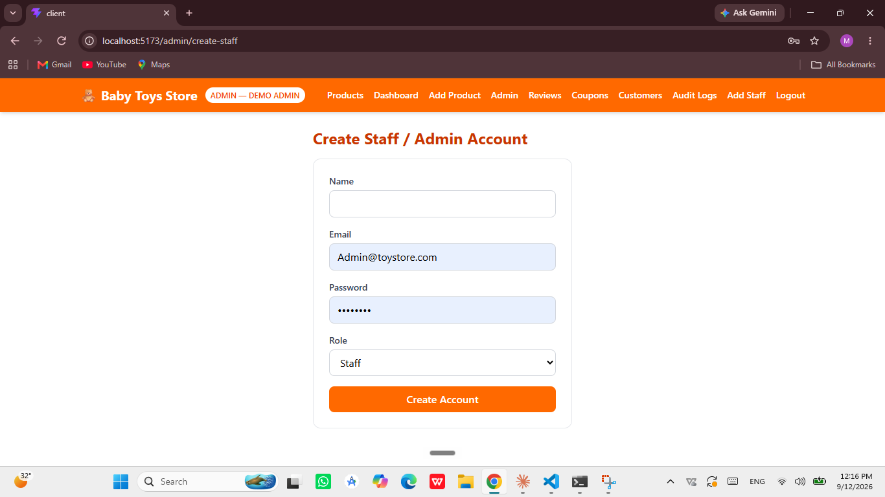
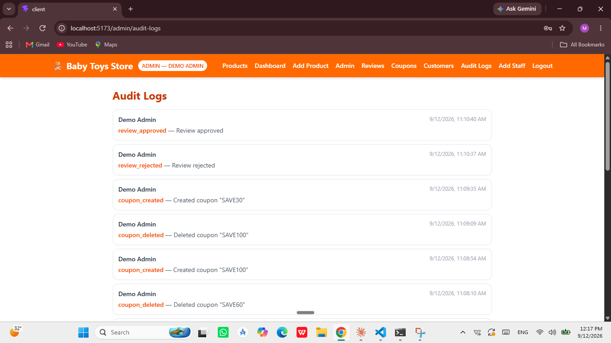

### API Documentation
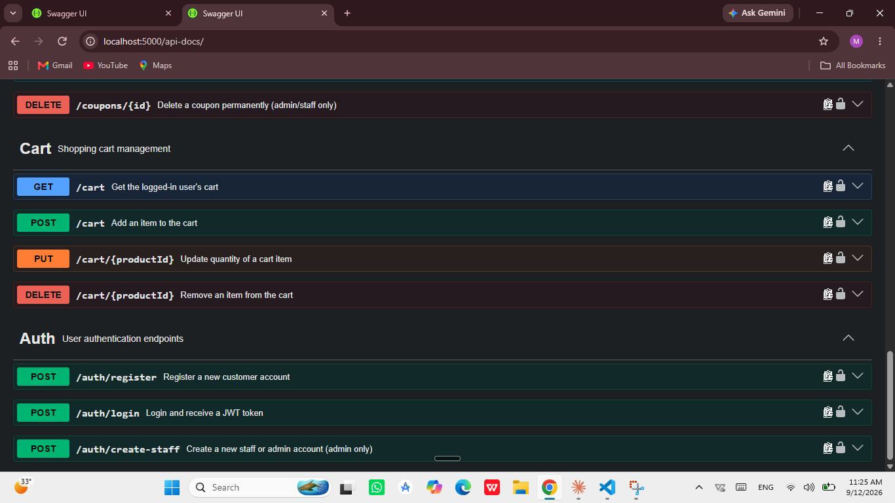

## 👩‍💻 Author

**Malaika Farooq**

BS Computer Science, GCUF (Punjab Group of Colleges, Jaranwala)

Built as part of an advanced MERN stack internship project for ULT Technology.

```


```